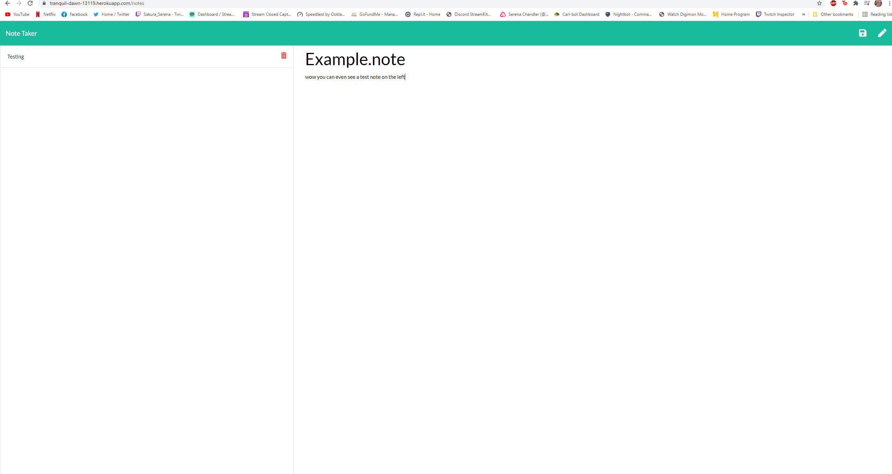

# NoteTaker

## Summary
Make a program that takes in user input, and saves it as notes. Clicking on the past note allows it be viewed.

## Deployed Link

[NoteTaker](https://tranquil-dawn-13119.herokuapp.com/notes)

## Example Image



## languages used
JavaScript was used to create routes, and post the notes to the page
HTML was used to construct the basic page elemts
CSS was used to style the page

## Code Snippets


Setting up basic routes so the html would present itse;f on the web pages
```
app.get("/", function(req, res) {
    res.sendFile(path.join(__dirname, "/public/index.html"));
  });

app.get("/notes", function(req, res) {
res.sendFile(path.join(__dirname, "/public/notes.html"));
});
```

Assigning Ids to each new note that is added, and making sure they increment with each one
```
         var newNote = req.body  
          var id = 0
          for (var i = 0; i < currentNotes.length; i++){
              var noteId = currentNotes[i]
              if (noteId.id > id){
                  id = noteId.id
              }
          }
          newNote.id = id + 1
```

## My Links

[GitHub](https://github.com/SerenaChandler)

[repo](https://github.com/SerenaChandler/teamprofilegenerator)